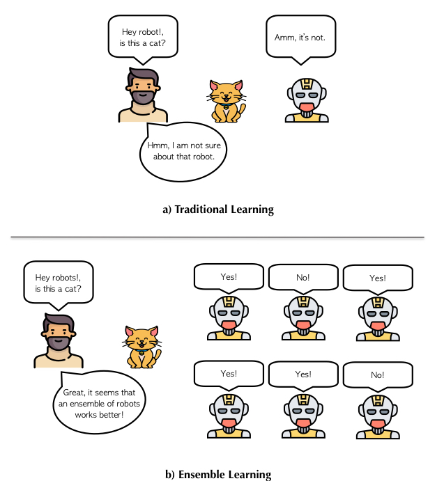

# Stacking Model

Using Model-Stacking to boost model performance and accuracy

---

## What is Model Stacking?

Model stacking is a Data Science ensemble method, which relies on the "wisdom of the crowd" premise that a diverse selection of combined "weaker" learners working together, will often outperform a single "strong" model. The winners of most major Kaggle competitions over the past 4–5 years have used some configuration of Model Stacking in their final winning models.
Model Stacking is analogous with real-world examples such as building successful human teams in business, science, sports etc. If all the members of the team were really good at the exact same task, then the team would crush any challenge that requires this one specific skill, but it would fail miserably when it comes to handling complex real-life problems that require a plethora of diverse skills, mindsets, and approaches. I do not know much about American football, but even with my limited knowledge, it is pretty obvious to me that you cannot win a football game with a team that consists of only quarterbacks, even if those quarterbacks are the best in the league. That is why optimal sports teams and successful business units consist of a diverse group of individuals with a wider range of strengths and weaknesses.

  

